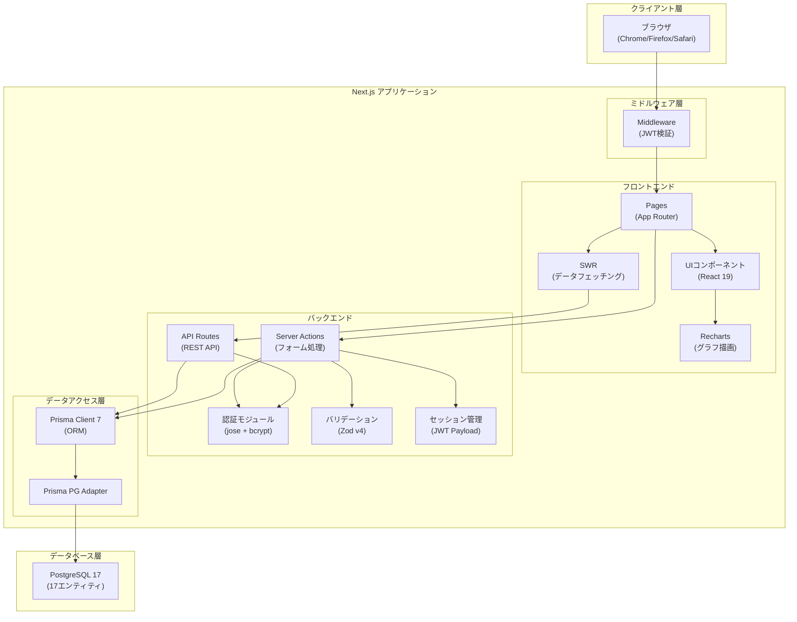
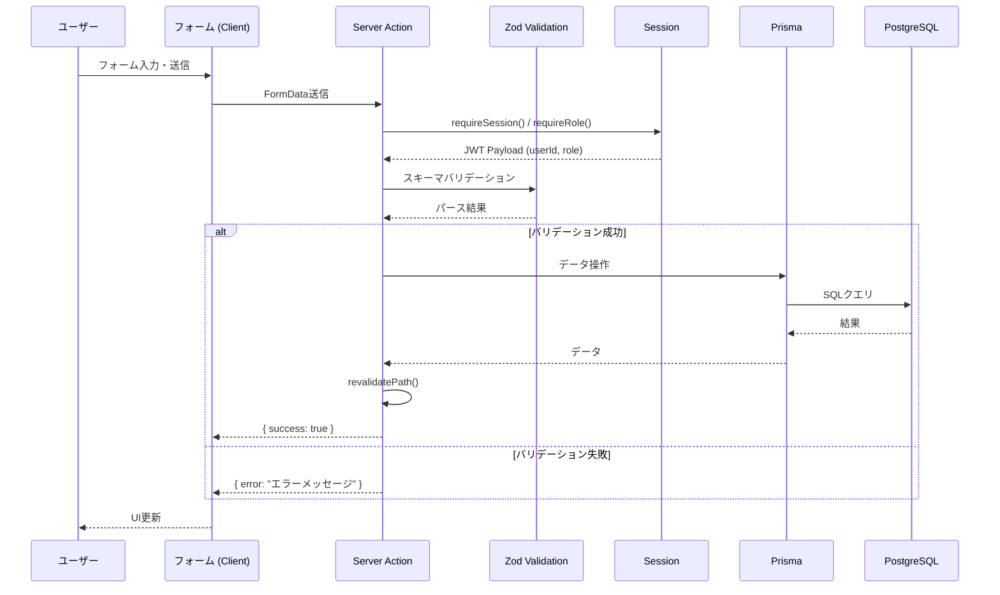
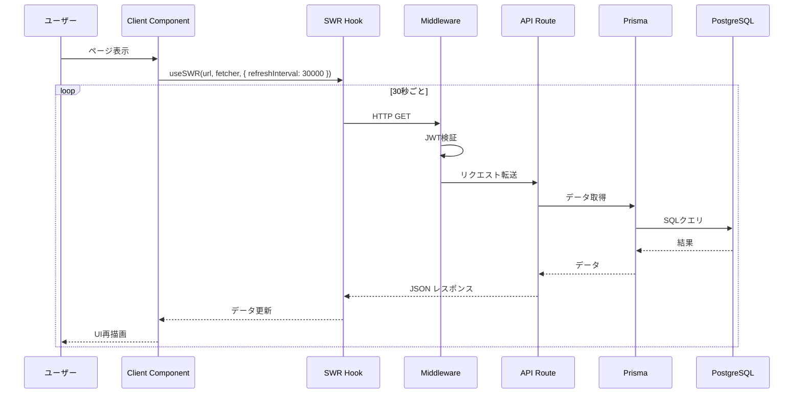
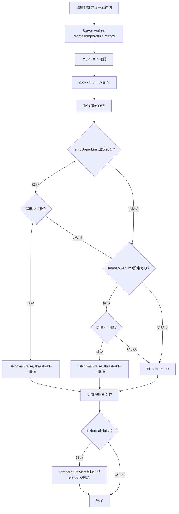
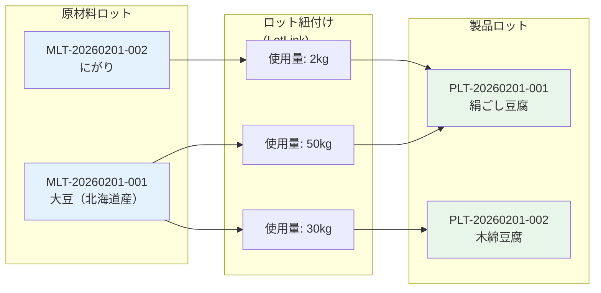
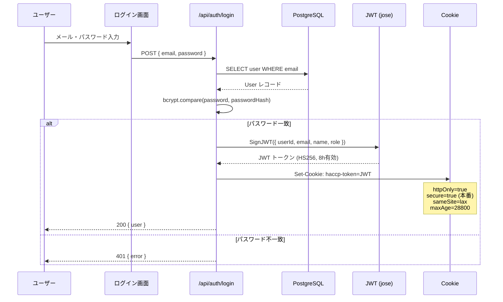
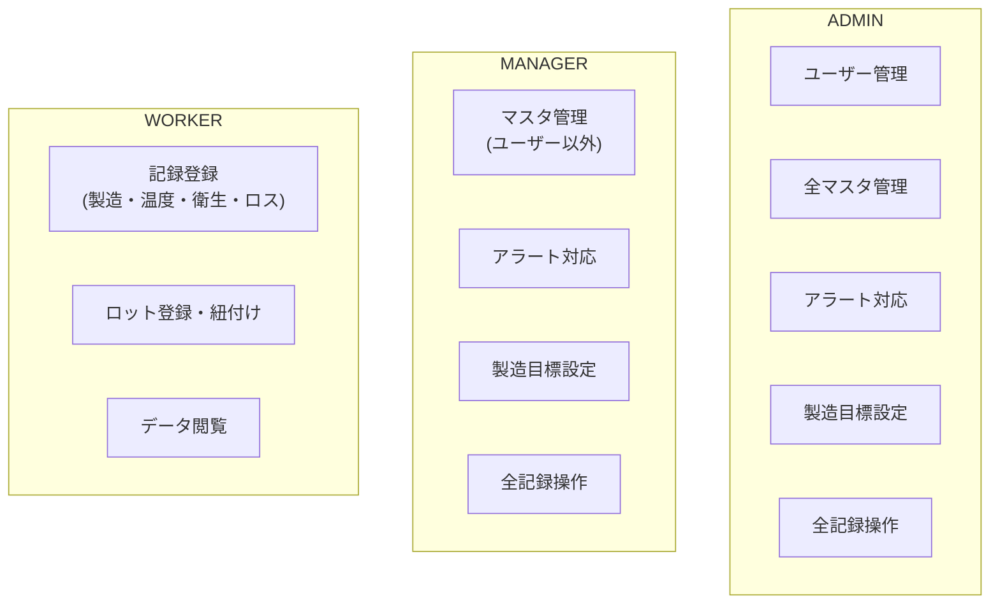
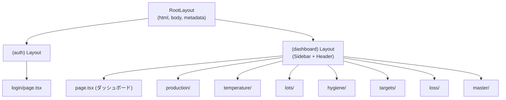
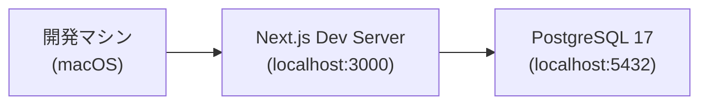
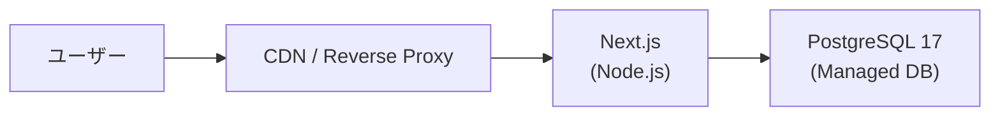

# アーキテクチャ設計書

## 川上食品 HACCP管理システム

| 項目 | 内容 |
|------|------|
| プロジェクト名 | 川上食品 HACCP管理システム |
| バージョン | v1.0.0 |
| 最終更新日 | 2026-02-09 |

---

## 1. システムアーキテクチャ概要



---

## 2. 技術スタック

### 2.1 フロントエンド

| 技術 | バージョン | 用途 |
|------|----------|------|
| Next.js | 16.1.6 | フルスタックフレームワーク（App Router） |
| React | 19.2.3 | UIライブラリ |
| TypeScript | 5.x | 型安全なJavaScript |
| Tailwind CSS | 4.x | ユーティリティファーストCSS |
| Recharts | 3.7.0 | グラフ・チャート描画 |
| SWR | 2.4.0 | データフェッチング・キャッシュ・ポーリング |
| Lucide React | 0.563.0 | アイコンライブラリ |
| clsx | 2.1.1 | 条件付きクラス名結合 |
| tailwind-merge | 3.4.0 | Tailwind CSSクラスのマージ |

### 2.2 バックエンド

| 技術 | バージョン | 用途 |
|------|----------|------|
| Next.js Server Actions | - | フォーム処理・サーバーサイドロジック |
| Next.js API Routes | - | REST API エンドポイント |
| Prisma | 7.3.0 | ORM・データベースアクセス |
| @prisma/adapter-pg | 7.3.0 | PostgreSQL接続アダプター |
| jose | 6.1.3 | JWT生成・検証 |
| bcryptjs | 3.0.3 | パスワードハッシュ化 |
| Zod | 4.3.6 | スキーマバリデーション |
| pg | 8.18.0 | PostgreSQL Node.jsドライバ |

### 2.3 データベース

| 技術 | バージョン | 用途 |
|------|----------|------|
| PostgreSQL | 17 | リレーショナルデータベース |

### 2.4 開発ツール

| 技術 | バージョン | 用途 |
|------|----------|------|
| ESLint | 9.x | コード品質チェック |
| @tailwindcss/postcss | 4.x | Tailwind CSS PostCSS プラグイン |
| tsx | 4.21.0 | TypeScript実行（Seed用） |
| ts-node | 10.9.2 | TypeScript実行 |

---

## 3. ディレクトリ構造

```
Kawakamishokuhin/
├── prisma/
│   ├── schema.prisma          # Prisma スキーマ定義（17エンティティ）
│   ├── seed.ts                # 初期データ投入スクリプト
│   └── migrations/            # マイグレーションファイル
├── src/
│   ├── middleware.ts           # Next.js Middleware（JWT認証チェック）
│   ├── actions/               # Server Actions
│   │   ├── auth.ts            # 認証（ログイン・ログアウト）
│   │   ├── production.ts      # 製造実績管理
│   │   ├── temperature.ts     # 温度管理・アラート
│   │   ├── lots.ts            # ロットトレーサビリティ
│   │   ├── hygiene.ts         # 衛生管理
│   │   ├── targets.ts         # 製造目標
│   │   ├── loss.ts            # ロス管理
│   │   └── master.ts          # マスタ管理（製品・原材料・設備・ユーザー）
│   ├── app/
│   │   ├── layout.tsx         # ルートレイアウト（html/body）
│   │   ├── globals.css        # グローバルCSS
│   │   ├── (auth)/
│   │   │   └── login/
│   │   │       └── page.tsx   # ログイン画面
│   │   ├── (dashboard)/
│   │   │   ├── layout.tsx     # ダッシュボードレイアウト（Sidebar + Header）
│   │   │   ├── page.tsx       # ダッシュボード（KPI・グラフ・アラート）
│   │   │   ├── production/
│   │   │   │   ├── page.tsx       # 製造実績一覧
│   │   │   │   ├── new/page.tsx   # 製造実績登録
│   │   │   │   └── [id]/page.tsx  # 製造実績詳細
│   │   │   ├── temperature/
│   │   │   │   ├── page.tsx       # 温度記録一覧
│   │   │   │   ├── new/page.tsx   # 温度記録登録
│   │   │   │   └── alerts/page.tsx # アラート管理
│   │   │   ├── lots/
│   │   │   │   ├── page.tsx       # ロット検索・管理
│   │   │   │   └── [id]/page.tsx  # ロット詳細・トレース
│   │   │   ├── hygiene/
│   │   │   │   ├── page.tsx       # 衛生記録一覧
│   │   │   │   └── new/page.tsx   # 衛生記録登録
│   │   │   ├── targets/
│   │   │   │   ├── page.tsx       # 製造目標一覧
│   │   │   │   ├── set/page.tsx   # 製造目標設定
│   │   │   │   └── analysis/page.tsx # 達成率分析
│   │   │   ├── loss/
│   │   │   │   ├── page.tsx       # ロス記録一覧
│   │   │   │   ├── new/page.tsx   # ロス記録登録
│   │   │   │   └── report/page.tsx # ロスレポート
│   │   │   └── master/
│   │   │       ├── products/page.tsx   # 製品マスタ
│   │   │       ├── materials/page.tsx  # 原材料マスタ
│   │   │       ├── facilities/page.tsx # 設備マスタ
│   │   │       └── users/page.tsx      # ユーザー管理
│   │   └── api/
│   │       ├── auth/
│   │       │   ├── login/route.ts     # POST: ログインAPI
│   │       │   ├── logout/route.ts    # POST: ログアウトAPI
│   │       │   └── me/route.ts        # GET: 現在ユーザー情報
│   │       └── dashboard/
│   │           ├── kpi/route.ts              # GET: KPIデータ
│   │           ├── alerts/route.ts           # GET: 未対応アラート
│   │           ├── production-chart/route.ts # GET: 製造実績グラフ
│   │           ├── temperature-status/route.ts # GET: 温度ステータス
│   │           └── recent-activities/route.ts  # GET: 最近のアクティビティ
│   ├── components/
│   │   ├── layout/
│   │   │   ├── sidebar.tsx    # サイドバーナビゲーション
│   │   │   └── header.tsx     # ヘッダー（ユーザー名・ログアウト）
│   │   └── ui/
│   │       ├── button.tsx     # ボタンコンポーネント
│   │       ├── input.tsx      # 入力フィールド
│   │       ├── select.tsx     # セレクトボックス
│   │       ├── table.tsx      # テーブル
│   │       ├── modal.tsx      # モーダルダイアログ
│   │       ├── badge.tsx      # バッジ（ステータス表示）
│   │       ├── pagination.tsx # ページネーション
│   │       ├── alert.tsx      # アラートメッセージ
│   │       └── card.tsx       # カードコンテナ
│   ├── lib/
│   │   ├── prisma.ts          # Prisma Client シングルトン
│   │   ├── auth.ts            # JWT生成・検証・Cookie管理
│   │   ├── session.ts         # セッション取得・権限チェック
│   │   └── utils.ts           # ユーティリティ関数（日付フォーマット等）
│   └── validations/
│       ├── auth.ts            # ログインバリデーション
│       ├── production.ts      # 製造実績バリデーション
│       ├── temperature.ts     # 温度記録・アラートバリデーション
│       ├── master.ts          # マスタ管理バリデーション
│       ├── hygiene.ts         # 衛生管理バリデーション
│       ├── lots.ts            # ロットバリデーション
│       ├── targets.ts         # 製造目標バリデーション
│       └── loss.ts            # ロス管理バリデーション
├── docs/                      # ドキュメント
├── package.json
├── tsconfig.json
├── next.config.ts
└── .env                       # 環境変数
```

---

## 4. データフロー

### 4.1 Server Actionフロー（フォーム送信）



### 4.2 API Routeフロー（SWRポーリング）



### 4.3 温度異常検出フロー



### 4.4 ロットトレーサビリティフロー



**前方トレース（Forward）:** 原材料ロット ML1 → [PL1, PL2]（この大豆はどの製品に使われたか）
**後方トレース（Backward）:** 製品ロット PL1 → [ML1, ML2]（この豆腐にはどの原材料が使われたか）

---

## 5. セキュリティアーキテクチャ

### 5.1 認証フロー



### 5.2 セキュリティ対策一覧

| 脅威 | 対策 | 実装箇所 |
|------|------|---------|
| パスワード漏洩 | bcryptjs (salt rounds=10) でハッシュ化 | `src/actions/master.ts` |
| セッションハイジャック | httpOnly Cookie + JWT | `src/lib/auth.ts` |
| CSRF | sameSite=lax Cookie + Server Actions | `src/lib/auth.ts` |
| XSS | Reactの自動エスケープ + httpOnly Cookie | React標準機能 |
| SQLインジェクション | Prismaのパラメータバインド | Prisma ORM |
| 不正アクセス | Middleware JWT検証 | `src/middleware.ts` |
| 権限昇格 | requireRole() によるロールチェック | `src/lib/session.ts` |
| トークン期限 | JWT 8時間有効期限 | `src/lib/auth.ts` |
| 自己削除防止 | userId比較チェック | `src/actions/master.ts` |

### 5.3 ロールベースアクセス制御



---

## 6. コンポーネントアーキテクチャ

### 6.1 レイアウト構造



### 6.2 共通UIコンポーネント

| コンポーネント | ファイル | 説明 |
|-------------|---------|------|
| Button | `components/ui/button.tsx` | ボタン（variant: primary/secondary/danger/ghost） |
| Input | `components/ui/input.tsx` | テキスト入力（ラベル・エラー表示対応） |
| Select | `components/ui/select.tsx` | セレクトボックス |
| Table | `components/ui/table.tsx` | データテーブル |
| Modal | `components/ui/modal.tsx` | モーダルダイアログ |
| Badge | `components/ui/badge.tsx` | ステータスバッジ（success/danger/warning/info） |
| Pagination | `components/ui/pagination.tsx` | ページネーション |
| Alert | `components/ui/alert.tsx` | アラートメッセージ（success/error/warning/info） |
| Card | `components/ui/card.tsx` | カードコンテナ（title/action対応） |

### 6.3 レイアウトコンポーネント

| コンポーネント | ファイル | 説明 |
|-------------|---------|------|
| Sidebar | `components/layout/sidebar.tsx` | 左サイドバーナビゲーション（固定幅240px） |
| Header | `components/layout/header.tsx` | 上部ヘッダー（タイトル・ユーザー名・ログアウト） |

---

## 7. データフェッチングパターン

### 7.1 Server Component（SSR）

Server Componentからは直接Server Actionを呼び出してデータを取得する。

```
page.tsx (Server Component)
  └── Server Action呼び出し（直接await）
       └── Prisma Query
            └── PostgreSQL
```

**使用箇所:** 製造実績一覧、温度記録一覧、ロット詳細 など

### 7.2 Client Component + SWR（CSR + ポーリング）

Client ComponentからはSWRを使用してAPI Routeからデータを取得する。30秒間隔のポーリングにより準リアルタイム更新を実現する。

```
page.tsx (Client Component)
  └── useSWR(url, fetcher, { refreshInterval: 30000 })
       └── fetch(API Route)
            └── Prisma Query
                 └── PostgreSQL
```

**使用箇所:** ダッシュボード（KPI、アラート、グラフ、温度ステータス）

### 7.3 Client Component + Server Action（フォーム）

フォーム送信にはuseActionState + Server Actionを使用する。

```
page.tsx (Client Component)
  └── useActionState(serverAction, initialState)
       └── <form action={formAction}>
            └── Server Action
                 └── Prisma Query
                      └── PostgreSQL
```

**使用箇所:** 全登録・更新フォーム

---

## 8. デプロイメントアーキテクチャ

### 8.1 開発環境



### 8.2 本番環境（想定）



---

## 9. 設計判断と根拠

| 判断 | 選択 | 根拠 |
|------|------|------|
| フレームワーク | Next.js 16 (App Router) | SSR/SSG対応、Server Actions、統合されたルーティング |
| ORM | Prisma 7 | 型安全なDB操作、マイグレーション管理、スキーマファースト |
| 認証 | JWT + httpOnly Cookie | ステートレス認証、XSS対策としてhttpOnly |
| バリデーション | Zod v4 | TypeScript統合、サーバー/クライアント共通スキーマ |
| データフェッチング | SWR | ダッシュボードのポーリング、キャッシュ管理 |
| グラフ | Recharts | React統合、レスポンシブ対応、宣言的API |
| CSS | Tailwind CSS v4 | 高速な開発、一貫したデザインシステム |
| PK | UUID | 分散環境対応、セキュリティ（推測困難） |
| 論理削除 | isActive フラグ | データ整合性維持、参照関係の保持 |
| ロット番号 | 自動採番 (PLT/MLT-YYYYMMDD-NNN) | 日付ベースの可読性、連番の衝突防止 |
