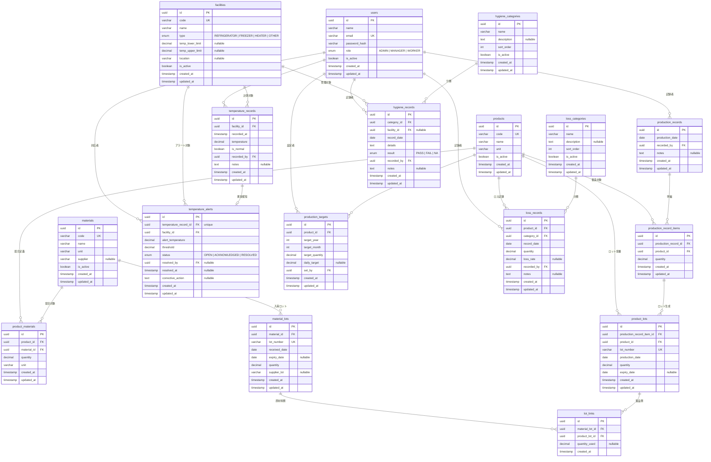

# 川上食品 HACCP管理システム ER図

## 概要

PostgreSQL + Prisma によるデータベース設計。全17エンティティ（マスタ系7 + トランザクション系10）。

---

## ER図（全体）

---

## テーブル一覧

### マスタ系（7テーブル）

| No | テーブル名 | 和名 | PK | ユニーク制約 |
|----|-----------|------|-----|------------|
| 1 | users | ユーザー | id (UUID) | email |
| 2 | products | 製品 | id (UUID) | code |
| 3 | materials | 原材料 | id (UUID) | code |
| 4 | facilities | 設備 | id (UUID) | code |
| 5 | product_materials | 製品配合（BOM） | id (UUID) | [product_id, material_id] |
| 6 | hygiene_categories | 衛生管理カテゴリ | id (UUID) | - |
| 7 | loss_categories | ロス原因カテゴリ | id (UUID) | - |

### トランザクション系（10テーブル）

| No | テーブル名 | 和名 | PK | ユニーク制約 |
|----|-----------|------|-----|------------|
| 8 | production_records | 製造実績 | id (UUID) | - |
| 9 | production_record_items | 製造実績明細 | id (UUID) | - |
| 10 | material_lots | 原材料ロット | id (UUID) | lot_number |
| 11 | product_lots | 製品ロット | id (UUID) | lot_number |
| 12 | lot_links | ロットトレーサビリティ | id (UUID) | - |
| 13 | temperature_records | 温度記録 | id (UUID) | - |
| 14 | temperature_alerts | 温度異常アラート | id (UUID) | temperature_record_id |
| 15 | hygiene_records | 衛生管理記録 | id (UUID) | - |
| 16 | production_targets | 製造目標 | id (UUID) | [product_id, target_year, target_month] |
| 17 | loss_records | ロス記録 | id (UUID) | - |

---

## 設計方針

| 項目 | 方針 |
|------|------|
| PK | 全テーブル UUID（`@default(uuid())`） |
| タイムスタンプ | 全テーブルに `created_at`, `updated_at` |
| 論理削除 | マスタ系は `is_active` フラグ |
| テーブル名 | snake_case（Prisma `@@map()`） |
| カラム名 | snake_case（Prisma `@map()`） |
| FK制約 | Prisma `@relation` で明示定義 |
| Decimal | 温度: `Decimal(5,2)`, 数量: `Decimal(10,2)`, ロス率: `Decimal(5,2)` |

---

## 更新履歴

| 日付 | 版 | 更新内容 | 更新者 |
|------|-----|----------|--------|
| 2026-02-09 | 1.0 | 初版作成 | - |
