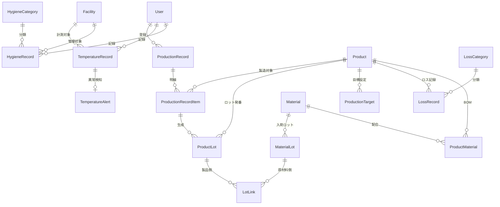

# 川上食品 HACCP管理システム エンティティ一覧

## 概要

要件定義書・画面遷移図・承認済みモックアップから抽出したドメインエンティティの一覧。
P1（HACCP対応）とP2（原価把握）の両フェーズを網羅する。

---

## エンティティ関連図（概要）

---

## 1. 認証・ユーザー管理

### 1.1 User（ユーザー）

| 属性 | 型 | 必須 | 説明 |
|------|-----|------|------|
| id | UUID | PK | ユーザーID |
| name | String | Yes | 氏名 |
| email | String | Yes | メールアドレス（ログインID） |
| password_hash | String | Yes | パスワードハッシュ |
| role | Enum | Yes | 権限（ADMIN / MANAGER / WORKER） |
| is_active | Boolean | Yes | 有効フラグ |
| created_at | DateTime | Yes | 作成日時 |
| updated_at | DateTime | Yes | 更新日時 |

**画面**: LOGIN, MASTER_USER

---

## 2. マスタ管理

### 2.1 Product（製品）

| 属性 | 型 | 必須 | 説明 |
|------|-----|------|------|
| id | UUID | PK | 製品ID |
| code | String | Yes | 製品コード（一意） |
| name | String | Yes | 製品名（例: 絹ごし豆腐、木綿豆腐、厚揚げ、油揚げ） |
| unit | String | Yes | 単位（個、パック、kg 等） |
| is_active | Boolean | Yes | 有効フラグ |
| created_at | DateTime | Yes | 作成日時 |
| updated_at | DateTime | Yes | 更新日時 |

**画面**: MASTER_PRODUCT

---

### 2.2 Material（原材料）

| 属性 | 型 | 必須 | 説明 |
|------|-----|------|------|
| id | UUID | PK | 原材料ID |
| code | String | Yes | 原材料コード（一意） |
| name | String | Yes | 原材料名 |
| unit | String | Yes | 単位（kg、L 等） |
| supplier | String | No | 仕入先名 |
| is_active | Boolean | Yes | 有効フラグ |
| created_at | DateTime | Yes | 作成日時 |
| updated_at | DateTime | Yes | 更新日時 |

**画面**: MASTER_MATERIAL

---

### 2.3 Facility（設備）

| 属性 | 型 | 必須 | 説明 |
|------|-----|------|------|
| id | UUID | PK | 設備ID |
| code | String | Yes | 設備コード（一意） |
| name | String | Yes | 設備名（例: 冷蔵庫A、冷蔵庫B、冷凍庫、加熱設備） |
| type | Enum | Yes | 設備種別（REFRIGERATOR / FREEZER / HEATER / OTHER） |
| temp_lower_limit | Decimal | No | 温度下限基準値（℃） |
| temp_upper_limit | Decimal | No | 温度上限基準値（℃） |
| location | String | No | 設置場所 |
| is_active | Boolean | Yes | 有効フラグ |
| created_at | DateTime | Yes | 作成日時 |
| updated_at | DateTime | Yes | 更新日時 |

**画面**: MASTER_FACILITY
**補足**: モックアップ上で「冷蔵庫B 基準値: 5℃以下」のように基準値による異常判定が必要

---

### 2.4 ProductMaterial（製品配合 / BOM）

| 属性 | 型 | 必須 | 説明 |
|------|-----|------|------|
| id | UUID | PK | ID |
| product_id | UUID | FK | 製品ID |
| material_id | UUID | FK | 原材料ID |
| quantity | Decimal | Yes | 標準使用量 |
| unit | String | Yes | 単位 |
| created_at | DateTime | Yes | 作成日時 |
| updated_at | DateTime | Yes | 更新日時 |

**補足**: 製品と原材料の多対多を解決する中間テーブル。ロストレーサビリティの基礎データ

---

## 3. フェーズ1: HACCP対応

### 3.1 ProductionRecord（製造実績）

| 属性 | 型 | 必須 | 説明 |
|------|-----|------|------|
| id | UUID | PK | 製造実績ID |
| production_date | Date | Yes | 製造日 |
| recorded_by | UUID | FK | 記録者（User） |
| notes | Text | No | 備考 |
| created_at | DateTime | Yes | 作成日時 |
| updated_at | DateTime | Yes | 更新日時 |

**画面**: PROD_LIST, PROD_NEW, PROD_DETAIL

---

### 3.2 ProductionRecordItem（製造実績明細）

| 属性 | 型 | 必須 | 説明 |
|------|-----|------|------|
| id | UUID | PK | 明細ID |
| production_record_id | UUID | FK | 製造実績ID |
| product_id | UUID | FK | 製品ID |
| quantity | Decimal | Yes | 製造数量 |
| created_at | DateTime | Yes | 作成日時 |
| updated_at | DateTime | Yes | 更新日時 |

**画面**: PROD_NEW, PROD_DETAIL
**補足**: 1日の製造実績に対し、複数製品の数量を記録

---

### 3.3 MaterialLot（原材料ロット）

| 属性 | 型 | 必須 | 説明 |
|------|-----|------|------|
| id | UUID | PK | 原材料ロットID |
| material_id | UUID | FK | 原材料ID |
| lot_number | String | Yes | ロット番号（一意） |
| received_date | Date | Yes | 入荷日 |
| expiry_date | Date | No | 賞味/消費期限 |
| quantity | Decimal | Yes | 入荷数量 |
| supplier_lot | String | No | 仕入先ロット番号 |
| created_at | DateTime | Yes | 作成日時 |
| updated_at | DateTime | Yes | 更新日時 |

**画面**: LOT_SEARCH, LOT_TRACE

---

### 3.4 ProductLot（製品ロット）

| 属性 | 型 | 必須 | 説明 |
|------|-----|------|------|
| id | UUID | PK | 製品ロットID |
| production_record_item_id | UUID | FK | 製造実績明細ID |
| product_id | UUID | FK | 製品ID |
| lot_number | String | Yes | ロット番号（一意） |
| production_date | Date | Yes | 製造日 |
| quantity | Decimal | Yes | 製造数量 |
| expiry_date | Date | No | 賞味/消費期限 |
| created_at | DateTime | Yes | 作成日時 |
| updated_at | DateTime | Yes | 更新日時 |

**画面**: LOT_SEARCH, LOT_TRACE

---

### 3.5 LotLink（ロットトレーサビリティ）

| 属性 | 型 | 必須 | 説明 |
|------|-----|------|------|
| id | UUID | PK | ID |
| material_lot_id | UUID | FK | 原材料ロットID |
| product_lot_id | UUID | FK | 製品ロットID |
| quantity_used | Decimal | No | 使用量 |
| created_at | DateTime | Yes | 作成日時 |

**画面**: LOT_TRACE
**補足**: 要件「逆引き検索（製品→原材料、原材料→製品）」を実現する中間テーブル

---

### 3.6 TemperatureRecord（温度記録）

| 属性 | 型 | 必須 | 説明 |
|------|-----|------|------|
| id | UUID | PK | 温度記録ID |
| facility_id | UUID | FK | 設備ID |
| recorded_at | DateTime | Yes | 計測日時 |
| temperature | Decimal | Yes | 計測温度（℃） |
| is_normal | Boolean | Yes | 正常/異常フラグ |
| recorded_by | UUID | FK | 記録者（User） |
| notes | Text | No | 備考 |
| created_at | DateTime | Yes | 作成日時 |
| updated_at | DateTime | Yes | 更新日時 |

**画面**: TEMP_LIST, TEMP_NEW
**補足**: モックアップの温度記録テーブル（冷蔵庫A: 3.2℃ 正常、冷蔵庫B: 8.5℃ 異常 等）

---

### 3.7 TemperatureAlert（温度異常アラート）

| 属性 | 型 | 必須 | 説明 |
|------|-----|------|------|
| id | UUID | PK | アラートID |
| temperature_record_id | UUID | FK | 温度記録ID |
| facility_id | UUID | FK | 設備ID |
| alert_temperature | Decimal | Yes | 異常検知温度（℃） |
| threshold | Decimal | Yes | 基準値（℃） |
| status | Enum | Yes | ステータス（OPEN / ACKNOWLEDGED / RESOLVED） |
| resolved_by | UUID | FK | 対応者（User） |
| resolved_at | DateTime | No | 対応日時 |
| corrective_action | Text | No | 是正措置内容 |
| created_at | DateTime | Yes | 作成日時 |
| updated_at | DateTime | Yes | 更新日時 |

**画面**: TEMP_ALERT, DASH（アラートバナー）
**補足**: モックアップの「冷蔵庫B 8.5℃ 基準値5℃以下」のアラート管理

---

### 3.8 HygieneCategory（衛生管理カテゴリ）

| 属性 | 型 | 必須 | 説明 |
|------|-----|------|------|
| id | UUID | PK | カテゴリID |
| name | String | Yes | カテゴリ名 |
| description | Text | No | 説明 |
| sort_order | Integer | Yes | 表示順 |
| is_active | Boolean | Yes | 有効フラグ |
| created_at | DateTime | Yes | 作成日時 |
| updated_at | DateTime | Yes | 更新日時 |

**初期データ**:
- 施設・設備の清掃
- 害虫駆除・防鼠管理
- 水質検査
- 廃棄物管理

---

### 3.9 HygieneRecord（衛生管理記録）

| 属性 | 型 | 必須 | 説明 |
|------|-----|------|------|
| id | UUID | PK | 衛生管理記録ID |
| category_id | UUID | FK | 衛生管理カテゴリID |
| facility_id | UUID | FK | 対象設備ID（任意） |
| record_date | Date | Yes | 記録日 |
| details | Text | Yes | 実施内容 |
| result | Enum | Yes | 結果（PASS / FAIL / NA） |
| recorded_by | UUID | FK | 記録者（User） |
| notes | Text | No | 備考 |
| created_at | DateTime | Yes | 作成日時 |
| updated_at | DateTime | Yes | 更新日時 |

**画面**: HYGIENE_LIST, HYGIENE_NEW

---

## 4. フェーズ2: 原価把握

### 4.1 ProductionTarget（製造目標）

| 属性 | 型 | 必須 | 説明 |
|------|-----|------|------|
| id | UUID | PK | 製造目標ID |
| product_id | UUID | FK | 製品ID |
| target_year | Integer | Yes | 対象年 |
| target_month | Integer | Yes | 対象月 |
| target_quantity | Decimal | Yes | 目標数量 |
| daily_target | Decimal | No | 日別目標数量 |
| set_by | UUID | FK | 設定者（User） |
| created_at | DateTime | Yes | 作成日時 |
| updated_at | DateTime | Yes | 更新日時 |

**画面**: TARGET_LIST, TARGET_SET, TARGET_ANALYSIS
**補足**: モックアップの目標達成率（94.2%）、製造実績チャートの目標ライン

---

### 4.2 LossCategory（ロス原因カテゴリ）

| 属性 | 型 | 必須 | 説明 |
|------|-----|------|------|
| id | UUID | PK | カテゴリID |
| name | String | Yes | カテゴリ名（例: 製造不良、破損、期限切れ、その他） |
| description | Text | No | 説明 |
| sort_order | Integer | Yes | 表示順 |
| is_active | Boolean | Yes | 有効フラグ |
| created_at | DateTime | Yes | 作成日時 |
| updated_at | DateTime | Yes | 更新日時 |

---

### 4.3 LossRecord（ロス記録）

| 属性 | 型 | 必須 | 説明 |
|------|-----|------|------|
| id | UUID | PK | ロス記録ID |
| product_id | UUID | FK | 製品ID |
| category_id | UUID | FK | ロス原因カテゴリID |
| record_date | Date | Yes | 発生日 |
| quantity | Decimal | Yes | ロス数量 |
| loss_rate | Decimal | No | ロス率（%）※算出値 |
| recorded_by | UUID | FK | 記録者（User） |
| notes | Text | No | 備考・原因詳細 |
| created_at | DateTime | Yes | 作成日時 |
| updated_at | DateTime | Yes | 更新日時 |

**画面**: LOSS_LIST, LOSS_NEW, LOSS_REPORT
**補足**: モックアップの製品別ロス率（絹ごし豆腐: 1.8%、木綿豆腐: 2.1%、厚揚げ: 3.5%、油揚げ: 4.2%）

---

## エンティティ一覧サマリ

| No | エンティティ | 和名 | フェーズ | 種別 |
|----|-------------|------|---------|------|
| 1 | User | ユーザー | 共通 | マスタ |
| 2 | Product | 製品 | 共通 | マスタ |
| 3 | Material | 原材料 | 共通 | マスタ |
| 4 | Facility | 設備 | 共通 | マスタ |
| 5 | ProductMaterial | 製品配合（BOM） | 共通 | マスタ |
| 6 | ProductionRecord | 製造実績 | P1 | トランザクション |
| 7 | ProductionRecordItem | 製造実績明細 | P1 | トランザクション |
| 8 | MaterialLot | 原材料ロット | P1 | トランザクション |
| 9 | ProductLot | 製品ロット | P1 | トランザクション |
| 10 | LotLink | ロットトレーサビリティ | P1 | トランザクション |
| 11 | TemperatureRecord | 温度記録 | P1 | トランザクション |
| 12 | TemperatureAlert | 温度異常アラート | P1 | トランザクション |
| 13 | HygieneCategory | 衛生管理カテゴリ | P1 | マスタ |
| 14 | HygieneRecord | 衛生管理記録 | P1 | トランザクション |
| 15 | ProductionTarget | 製造目標 | P2 | トランザクション |
| 16 | LossCategory | ロス原因カテゴリ | P2 | マスタ |
| 17 | LossRecord | ロス記録 | P2 | トランザクション |

**合計: 17 エンティティ**（マスタ系 7 + トランザクション系 10）

---

## 更新履歴

| 日付 | 版 | 更新内容 | 更新者 |
|------|-----|----------|--------|
| 2026-02-09 | 1.0 | 初版作成 | - |
