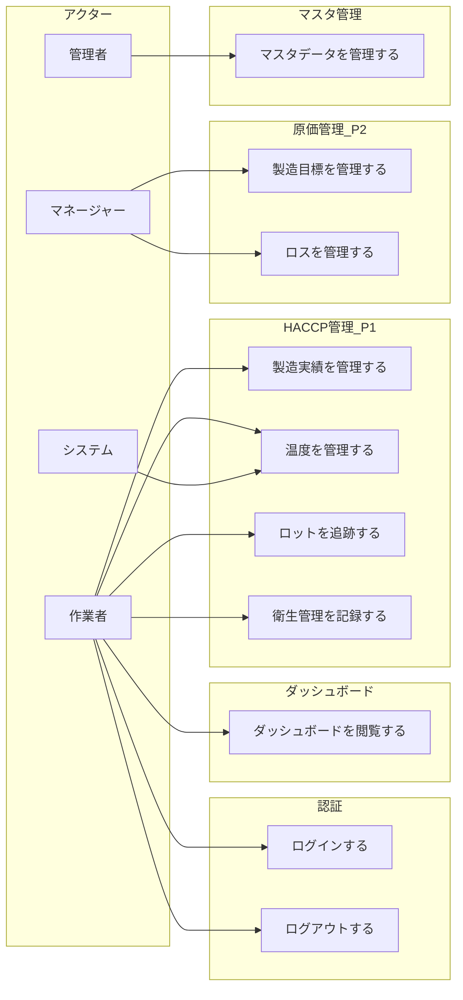

# 川上食品 HACCP管理システム ユースケース一覧

## 概要

要件定義書・画面遷移図・エンティティ一覧から導出したユースケースの一覧。
各ユースケースにアクター、対応画面、関連エンティティ、フェーズを記載する。

---

## アクター定義

| アクター | ロール | 説明 |
|---------|--------|------|
| 管理者 | ADMIN | システム全体の管理。マスタ管理・ユーザー管理を含む全操作が可能 |
| マネージャー | MANAGER | 現場管理者。目標設定・レポート閲覧・記録の承認が可能 |
| 作業者 | WORKER | 現場作業員。日常の記録入力・閲覧が可能 |
| システム | - | 自動処理（温度異常検知等） |

---

## ユースケース図（概要）

---

## 1. 認証

### UC-AUTH-01: ログインする

| 項目 | 内容 |
|------|------|
| **ID** | UC-AUTH-01 |
| **アクター** | 全ユーザー |
| **画面** | LOGIN |
| **フェーズ** | 共通 |
| **関連エンティティ** | User |
| **概要** | メールアドレスとパスワードでシステムにログインする |
| **事前条件** | ユーザーアカウントが作成済みかつ有効 |
| **事後条件** | 認証セッションが開始され、ダッシュボードに遷移 |
| **基本フロー** | 1. メールアドレスを入力する 2. パスワードを入力する 3. ログインボタンを押す 4. システムが認証を検証する 5. ダッシュボードに遷移する |
| **代替フロー** | 4a. 認証失敗 → エラーメッセージを表示し再入力を促す |

---

### UC-AUTH-02: ログアウトする

| 項目 | 内容 |
|------|------|
| **ID** | UC-AUTH-02 |
| **アクター** | 全ユーザー |
| **画面** | 共通（サイドバー） |
| **フェーズ** | 共通 |
| **関連エンティティ** | User |
| **概要** | システムからログアウトする |
| **事前条件** | ログイン済み |
| **事後条件** | セッションが終了し、ログイン画面に遷移 |

---

## 2. ダッシュボード

### UC-DASH-01: ダッシュボードを閲覧する

| 項目 | 内容 |
|------|------|
| **ID** | UC-DASH-01 |
| **アクター** | 全ユーザー |
| **画面** | DASH |
| **フェーズ** | 共通 |
| **関連エンティティ** | ProductionRecord, ProductionRecordItem, TemperatureRecord, TemperatureAlert, LossRecord, ProductionTarget |
| **概要** | システム全体の状況をKPI・チャート・アラートで一覧確認する |
| **事前条件** | ログイン済み |
| **事後条件** | - |
| **表示内容** | - KPIカード（本日の製造数量、目標達成率、ロス率、温度異常件数） - 温度異常アラートバナー - 製造実績チャート（今週・目標対比） - 温度記録一覧（最新） - 本日のタスク - 製品別ロス率ゲージ - クイックアクションボタン |

---

## 3. フェーズ1: HACCP対応 - 製造管理

### UC-PROD-01: 製造実績一覧を閲覧する

| 項目 | 内容 |
|------|------|
| **ID** | UC-PROD-01 |
| **アクター** | 全ユーザー |
| **画面** | PROD_LIST |
| **フェーズ** | P1 |
| **関連エンティティ** | ProductionRecord, ProductionRecordItem, Product |
| **概要** | 製造実績の一覧を表示し、日付・製品で検索・絞り込みを行う |
| **事前条件** | ログイン済み |
| **事後条件** | - |
| **基本フロー** | 1. 製造実績一覧画面を開く 2. 日付範囲・製品名で絞り込み条件を指定する（任意） 3. 一覧が表示される |

---

### UC-PROD-02: 製造実績を登録する

| 項目 | 内容 |
|------|------|
| **ID** | UC-PROD-02 |
| **アクター** | 作業者、マネージャー |
| **画面** | PROD_NEW |
| **フェーズ** | P1 |
| **関連エンティティ** | ProductionRecord, ProductionRecordItem, Product, ProductLot, MaterialLot, LotLink |
| **概要** | 製造日・製品ごとの製造数量・使用原材料ロットを記録する |
| **事前条件** | ログイン済み。製品マスタ・原材料マスタが登録済み |
| **事後条件** | 製造実績が保存される。製品ロットが発番される。原材料ロットとの紐付けが記録される |
| **基本フロー** | 1. 製造実績登録画面を開く 2. 製造日を入力する 3. 製品を選択し、製造数量を入力する（複数製品可） 4. 使用した原材料ロット番号を入力する 5. 登録ボタンを押す 6. 製品ロットが自動発番される 7. ロットトレーサビリティ（LotLink）が自動生成される |
| **代替フロー** | 5a. 必須項目未入力 → バリデーションエラーを表示する |

---

### UC-PROD-03: 製造実績詳細を閲覧する

| 項目 | 内容 |
|------|------|
| **ID** | UC-PROD-03 |
| **アクター** | 全ユーザー |
| **画面** | PROD_DETAIL |
| **フェーズ** | P1 |
| **関連エンティティ** | ProductionRecord, ProductionRecordItem, Product, ProductLot |
| **概要** | 特定の製造実績の詳細（明細・ロット情報）を確認する |
| **事前条件** | 対象の製造実績が存在する |
| **事後条件** | - |
| **基本フロー** | 1. 製造実績一覧から対象レコードを選択する 2. 製造日・記録者・製品別数量・ロット番号が表示される 3. ロット番号からトレーサビリティ画面に遷移できる |

---

### UC-PROD-04: 製造実績を編集する

| 項目 | 内容 |
|------|------|
| **ID** | UC-PROD-04 |
| **アクター** | マネージャー |
| **画面** | PROD_DETAIL |
| **フェーズ** | P1 |
| **関連エンティティ** | ProductionRecord, ProductionRecordItem |
| **概要** | 登録済みの製造実績の数量・備考を修正する |
| **事前条件** | 対象の製造実績が存在する |
| **事後条件** | 修正内容が保存される |
| **基本フロー** | 1. 製造実績詳細画面で編集ボタンを押す 2. 数量・備考を修正する 3. 保存ボタンを押す |

---

## 4. フェーズ1: HACCP対応 - 温度管理

### UC-TEMP-01: 温度記録一覧を閲覧する

| 項目 | 内容 |
|------|------|
| **ID** | UC-TEMP-01 |
| **アクター** | 全ユーザー |
| **画面** | TEMP_LIST |
| **フェーズ** | P1 |
| **関連エンティティ** | TemperatureRecord, Facility |
| **概要** | 設備ごとの温度記録一覧を表示する |
| **事前条件** | ログイン済み |
| **事後条件** | - |
| **基本フロー** | 1. 温度記録一覧画面を開く 2. 設備・日付範囲で絞り込みを行う（任意） 3. 各記録の設備名・温度・正常/異常状態が表示される |

---

### UC-TEMP-02: 温度を記録する

| 項目 | 内容 |
|------|------|
| **ID** | UC-TEMP-02 |
| **アクター** | 作業者、マネージャー |
| **画面** | TEMP_NEW |
| **フェーズ** | P1 |
| **関連エンティティ** | TemperatureRecord, TemperatureAlert, Facility |
| **概要** | 設備の温度を計測・記録する。基準値逸脱時はアラートを自動生成する |
| **事前条件** | ログイン済み。設備マスタが登録済み |
| **事後条件** | 温度記録が保存される。異常時はTemperatureAlertが生成される |
| **基本フロー** | 1. 温度記録登録画面を開く 2. 設備を選択する 3. 計測温度を入力する 4. 登録ボタンを押す 5. システムが設備の基準値と比較する 6. 正常範囲内 → 正常として記録される |
| **代替フロー** | 6a. 基準値逸脱 → 異常フラグが設定され、TemperatureAlertが自動生成される。ダッシュボードにアラートバナーが表示される |

---

### UC-TEMP-03: 温度異常アラート一覧を閲覧する

| 項目 | 内容 |
|------|------|
| **ID** | UC-TEMP-03 |
| **アクター** | 全ユーザー |
| **画面** | TEMP_ALERT |
| **フェーズ** | P1 |
| **関連エンティティ** | TemperatureAlert, TemperatureRecord, Facility |
| **概要** | 未対応・対応済みの温度異常アラートを一覧で確認する |
| **事前条件** | ログイン済み |
| **事後条件** | - |
| **基本フロー** | 1. 温度異常アラート画面を開く 2. ステータス（未対応/確認済み/対応済み）で絞り込みを行う（任意） 3. アラートの設備名・異常温度・基準値・ステータスが表示される |

---

### UC-TEMP-04: 温度異常に対応する

| 項目 | 内容 |
|------|------|
| **ID** | UC-TEMP-04 |
| **アクター** | マネージャー |
| **画面** | TEMP_ALERT |
| **フェーズ** | P1 |
| **関連エンティティ** | TemperatureAlert |
| **概要** | 温度異常アラートに対して是正措置を記録し、ステータスを更新する |
| **事前条件** | ステータスがOPENまたはACKNOWLEDGEDのアラートが存在する |
| **事後条件** | アラートのステータスが更新され、是正措置が記録される |
| **基本フロー** | 1. アラート一覧から対象を選択する 2. 是正措置の内容を入力する 3. ステータスを「対応済み（RESOLVED）」に変更する 4. 保存する |

---

## 5. フェーズ1: HACCP対応 - ロット管理

### UC-LOT-01: ロット番号で検索する

| 項目 | 内容 |
|------|------|
| **ID** | UC-LOT-01 |
| **アクター** | 全ユーザー |
| **画面** | LOT_SEARCH |
| **フェーズ** | P1 |
| **関連エンティティ** | MaterialLot, ProductLot, Product, Material |
| **概要** | 原材料ロット番号または製品ロット番号で検索し、該当ロットの情報を表示する |
| **事前条件** | ログイン済み |
| **事後条件** | - |
| **基本フロー** | 1. ロット検索画面を開く 2. ロット番号（全部または一部）を入力する 3. 検索ボタンを押す 4. 該当するロットの一覧（種別・品名・日付・数量）が表示される |

---

### UC-LOT-02: 製品から原材料を追跡する（順方向）

| 項目 | 内容 |
|------|------|
| **ID** | UC-LOT-02 |
| **アクター** | 全ユーザー |
| **画面** | LOT_TRACE |
| **フェーズ** | P1 |
| **関連エンティティ** | ProductLot, LotLink, MaterialLot, Product, Material |
| **概要** | 製品ロットから使用された原材料ロットを追跡する |
| **事前条件** | 対象の製品ロットが存在し、LotLinkが紐付いている |
| **事後条件** | - |
| **基本フロー** | 1. ロット検索結果またはレコード詳細から製品ロットを選択する 2. トレーサビリティ画面が表示される 3. 使用された全原材料ロットの情報（原材料名・ロット番号・使用量・仕入先）が表示される |

---

### UC-LOT-03: 原材料から製品を追跡する（逆方向）

| 項目 | 内容 |
|------|------|
| **ID** | UC-LOT-03 |
| **アクター** | 全ユーザー |
| **画面** | LOT_TRACE |
| **フェーズ** | P1 |
| **関連エンティティ** | MaterialLot, LotLink, ProductLot, Product, Material |
| **概要** | 原材料ロットから製造された製品ロットを追跡する（リコール対応等） |
| **事前条件** | 対象の原材料ロットが存在し、LotLinkが紐付いている |
| **事後条件** | - |
| **基本フロー** | 1. ロット検索結果から原材料ロットを選択する 2. トレーサビリティ画面が表示される 3. 当該原材料を使用した全製品ロットの情報（製品名・ロット番号・製造日・数量）が表示される |

---

### UC-LOT-04: ロット追跡レポートを出力する

| 項目 | 内容 |
|------|------|
| **ID** | UC-LOT-04 |
| **アクター** | マネージャー |
| **画面** | LOT_TRACE |
| **フェーズ** | P1 |
| **関連エンティティ** | ProductLot, MaterialLot, LotLink |
| **概要** | ロット追跡結果をPDF/CSVレポートとして出力する |
| **事前条件** | トレーサビリティ画面で追跡結果が表示されている |
| **事後条件** | レポートファイルがダウンロードされる |
| **基本フロー** | 1. トレーサビリティ画面でレポート出力ボタンを押す 2. 出力形式（PDF/CSV）を選択する 3. レポートが生成・ダウンロードされる |

---

## 6. フェーズ1: HACCP対応 - 衛生管理

### UC-HYG-01: 衛生管理記録一覧を閲覧する

| 項目 | 内容 |
|------|------|
| **ID** | UC-HYG-01 |
| **アクター** | 全ユーザー |
| **画面** | HYGIENE_LIST |
| **フェーズ** | P1 |
| **関連エンティティ** | HygieneRecord, HygieneCategory, Facility |
| **概要** | 衛生管理記録の一覧をカテゴリ・日付で絞り込んで表示する |
| **事前条件** | ログイン済み |
| **事後条件** | - |
| **基本フロー** | 1. 衛生管理記録一覧画面を開く 2. カテゴリ（清掃/害虫/水質/廃棄物）・日付で絞り込む（任意） 3. 記録日・カテゴリ・対象設備・結果が一覧表示される |

---

### UC-HYG-02: 衛生管理記録を登録する

| 項目 | 内容 |
|------|------|
| **ID** | UC-HYG-02 |
| **アクター** | 作業者、マネージャー |
| **画面** | HYGIENE_NEW |
| **フェーズ** | P1 |
| **関連エンティティ** | HygieneRecord, HygieneCategory, Facility |
| **概要** | 施設・設備の衛生管理（清掃、害虫駆除、水質検査、廃棄物管理）の実施結果を記録する |
| **事前条件** | ログイン済み。衛生管理カテゴリが登録済み |
| **事後条件** | 衛生管理記録が保存される |
| **基本フロー** | 1. 衛生管理記録登録画面を開く 2. カテゴリを選択する 3. 対象設備を選択する（任意） 4. 記録日を入力する 5. 実施内容を入力する 6. 結果（合格/不合格/該当なし）を選択する 7. 登録ボタンを押す |

---

## 7. フェーズ2: 原価把握 - 製造目標

### UC-TGT-01: 製造目標一覧を閲覧する

| 項目 | 内容 |
|------|------|
| **ID** | UC-TGT-01 |
| **アクター** | マネージャー、管理者 |
| **画面** | TARGET_LIST |
| **フェーズ** | P2 |
| **関連エンティティ** | ProductionTarget, Product |
| **概要** | 製品ごとの月次製造目標一覧を閲覧する |
| **事前条件** | ログイン済み |
| **事後条件** | - |
| **基本フロー** | 1. 製造目標一覧画面を開く 2. 年月・製品で絞り込む（任意） 3. 製品名・対象月・目標数量・達成率が一覧表示される |

---

### UC-TGT-02: 製造目標を設定する

| 項目 | 内容 |
|------|------|
| **ID** | UC-TGT-02 |
| **アクター** | マネージャー |
| **画面** | TARGET_SET |
| **フェーズ** | P2 |
| **関連エンティティ** | ProductionTarget, Product |
| **概要** | 製品ごとの月次製造目標数量を設定する |
| **事前条件** | ログイン済み。製品マスタが登録済み |
| **事後条件** | 製造目標が保存される |
| **基本フロー** | 1. 目標設定画面を開く 2. 対象年月を選択する 3. 製品を選択する 4. 月次目標数量を入力する 5. 日別目標数量を入力する（任意） 6. 保存ボタンを押す |

---

### UC-TGT-03: 目標vs実績の差異分析を行う

| 項目 | 内容 |
|------|------|
| **ID** | UC-TGT-03 |
| **アクター** | マネージャー、管理者 |
| **画面** | TARGET_ANALYSIS |
| **フェーズ** | P2 |
| **関連エンティティ** | ProductionTarget, ProductionRecord, ProductionRecordItem, Product |
| **概要** | 製造目標と実績の差異を分析し、達成率を確認する |
| **事前条件** | 目標と実績データが存在する |
| **事後条件** | - |
| **基本フロー** | 1. 差異分析画面を開く 2. 対象年月を選択する 3. 製品別の目標数量・実績数量・差異・達成率が表示される 4. 達成率のダッシュボード表示（グラフ）を確認する |

---

## 8. フェーズ2: 原価把握 - ロス管理

### UC-LOSS-01: ロス記録一覧を閲覧する

| 項目 | 内容 |
|------|------|
| **ID** | UC-LOSS-01 |
| **アクター** | マネージャー、管理者 |
| **画面** | LOSS_LIST |
| **フェーズ** | P2 |
| **関連エンティティ** | LossRecord, LossCategory, Product |
| **概要** | ロス記録の一覧を製品・原因カテゴリ・日付で絞り込んで表示する |
| **事前条件** | ログイン済み |
| **事後条件** | - |
| **基本フロー** | 1. ロス記録一覧画面を開く 2. 製品・原因カテゴリ・日付範囲で絞り込む（任意） 3. 発生日・製品名・原因・ロス数量・ロス率が一覧表示される |

---

### UC-LOSS-02: ロス記録を登録する

| 項目 | 内容 |
|------|------|
| **ID** | UC-LOSS-02 |
| **アクター** | 作業者、マネージャー |
| **画面** | LOSS_NEW |
| **フェーズ** | P2 |
| **関連エンティティ** | LossRecord, LossCategory, Product |
| **概要** | 製品のロス発生を記録する |
| **事前条件** | ログイン済み。製品マスタ・ロス原因カテゴリが登録済み |
| **事後条件** | ロス記録が保存される |
| **基本フロー** | 1. ロス記録登録画面を開く 2. 発生日を入力する 3. 製品を選択する 4. ロス原因カテゴリを選択する（製造不良/破損/期限切れ等） 5. ロス数量を入力する 6. 備考・原因詳細を入力する（任意） 7. 登録ボタンを押す |

---

### UC-LOSS-03: ロス分析レポートを閲覧する

| 項目 | 内容 |
|------|------|
| **ID** | UC-LOSS-03 |
| **アクター** | マネージャー、管理者 |
| **画面** | LOSS_REPORT |
| **フェーズ** | P2 |
| **関連エンティティ** | LossRecord, LossCategory, Product, ProductionRecordItem |
| **概要** | 製品別ロス率の推移・原因別分析をグラフ・表で確認する |
| **事前条件** | ロス記録・製造実績データが存在する |
| **事後条件** | - |
| **基本フロー** | 1. ロス分析レポート画面を開く 2. 対象期間を選択する 3. 製品別ロス率の推移グラフが表示される 4. 原因別のロス内訳が表示される 5. ロス削減目標との比較が表示される |

---

## 9. マスタ管理

### UC-MST-01: 製品マスタを管理する

| 項目 | 内容 |
|------|------|
| **ID** | UC-MST-01 |
| **アクター** | 管理者 |
| **画面** | MASTER_PRODUCT |
| **フェーズ** | 共通 |
| **関連エンティティ** | Product, ProductMaterial |
| **概要** | 製品情報の一覧表示・新規登録・編集・無効化を行う |
| **操作** | 一覧表示 / 新規登録 / 編集 / 無効化 |
| **主な入力項目** | 製品コード、製品名、単位、配合情報（BOM） |

---

### UC-MST-02: 原材料マスタを管理する

| 項目 | 内容 |
|------|------|
| **ID** | UC-MST-02 |
| **アクター** | 管理者 |
| **画面** | MASTER_MATERIAL |
| **フェーズ** | 共通 |
| **関連エンティティ** | Material |
| **概要** | 原材料情報の一覧表示・新規登録・編集・無効化を行う |
| **操作** | 一覧表示 / 新規登録 / 編集 / 無効化 |
| **主な入力項目** | 原材料コード、原材料名、単位、仕入先 |

---

### UC-MST-03: 設備マスタを管理する

| 項目 | 内容 |
|------|------|
| **ID** | UC-MST-03 |
| **アクター** | 管理者 |
| **画面** | MASTER_FACILITY |
| **フェーズ** | 共通 |
| **関連エンティティ** | Facility |
| **概要** | 設備情報の一覧表示・新規登録・編集・無効化を行う。温度基準値を設定する |
| **操作** | 一覧表示 / 新規登録 / 編集 / 無効化 |
| **主な入力項目** | 設備コード、設備名、種別、温度上限・下限基準値、設置場所 |

---

### UC-MST-04: ユーザーを管理する

| 項目 | 内容 |
|------|------|
| **ID** | UC-MST-04 |
| **アクター** | 管理者 |
| **画面** | MASTER_USER |
| **フェーズ** | 共通 |
| **関連エンティティ** | User |
| **概要** | ユーザーアカウントの一覧表示・新規登録・編集・無効化を行う |
| **操作** | 一覧表示 / 新規登録 / 編集 / 無効化 |
| **主な入力項目** | 氏名、メールアドレス、パスワード、権限（ADMIN/MANAGER/WORKER） |

---

## ユースケース一覧サマリ

| No | ID | ユースケース名 | アクター | フェーズ | 画面 |
|----|----|---------------|---------|---------|------|
| 1 | UC-AUTH-01 | ログインする | 全ユーザー | 共通 | LOGIN |
| 2 | UC-AUTH-02 | ログアウトする | 全ユーザー | 共通 | 共通 |
| 3 | UC-DASH-01 | ダッシュボードを閲覧する | 全ユーザー | 共通 | DASH |
| 4 | UC-PROD-01 | 製造実績一覧を閲覧する | 全ユーザー | P1 | PROD_LIST |
| 5 | UC-PROD-02 | 製造実績を登録する | 作業者, マネージャー | P1 | PROD_NEW |
| 6 | UC-PROD-03 | 製造実績詳細を閲覧する | 全ユーザー | P1 | PROD_DETAIL |
| 7 | UC-PROD-04 | 製造実績を編集する | マネージャー | P1 | PROD_DETAIL |
| 8 | UC-TEMP-01 | 温度記録一覧を閲覧する | 全ユーザー | P1 | TEMP_LIST |
| 9 | UC-TEMP-02 | 温度を記録する | 作業者, マネージャー | P1 | TEMP_NEW |
| 10 | UC-TEMP-03 | 温度異常アラート一覧を閲覧する | 全ユーザー | P1 | TEMP_ALERT |
| 11 | UC-TEMP-04 | 温度異常に対応する | マネージャー | P1 | TEMP_ALERT |
| 12 | UC-LOT-01 | ロット番号で検索する | 全ユーザー | P1 | LOT_SEARCH |
| 13 | UC-LOT-02 | 製品から原材料を追跡する | 全ユーザー | P1 | LOT_TRACE |
| 14 | UC-LOT-03 | 原材料から製品を追跡する | 全ユーザー | P1 | LOT_TRACE |
| 15 | UC-LOT-04 | ロット追跡レポートを出力する | マネージャー | P1 | LOT_TRACE |
| 16 | UC-HYG-01 | 衛生管理記録一覧を閲覧する | 全ユーザー | P1 | HYGIENE_LIST |
| 17 | UC-HYG-02 | 衛生管理記録を登録する | 作業者, マネージャー | P1 | HYGIENE_NEW |
| 18 | UC-TGT-01 | 製造目標一覧を閲覧する | マネージャー, 管理者 | P2 | TARGET_LIST |
| 19 | UC-TGT-02 | 製造目標を設定する | マネージャー | P2 | TARGET_SET |
| 20 | UC-TGT-03 | 目標vs実績の差異分析を行う | マネージャー, 管理者 | P2 | TARGET_ANALYSIS |
| 21 | UC-LOSS-01 | ロス記録一覧を閲覧する | マネージャー, 管理者 | P2 | LOSS_LIST |
| 22 | UC-LOSS-02 | ロス記録を登録する | 作業者, マネージャー | P2 | LOSS_NEW |
| 23 | UC-LOSS-03 | ロス分析レポートを閲覧する | マネージャー, 管理者 | P2 | LOSS_REPORT |
| 24 | UC-MST-01 | 製品マスタを管理する | 管理者 | 共通 | MASTER_PRODUCT |
| 25 | UC-MST-02 | 原材料マスタを管理する | 管理者 | 共通 | MASTER_MATERIAL |
| 26 | UC-MST-03 | 設備マスタを管理する | 管理者 | 共通 | MASTER_FACILITY |
| 27 | UC-MST-04 | ユーザーを管理する | 管理者 | 共通 | MASTER_USER |

**合計: 27 ユースケース**（認証 2 + ダッシュボード 1 + 製造管理 4 + 温度管理 4 + ロット管理 4 + 衛生管理 2 + 製造目標 3 + ロス管理 3 + マスタ管理 4）

---

## アクター別アクセス権限マトリクス

| ユースケース | 管理者 | マネージャー | 作業者 |
|-------------|:------:|:----------:|:-----:|
| UC-AUTH-01/02 ログイン/ログアウト | o | o | o |
| UC-DASH-01 ダッシュボード閲覧 | o | o | o |
| UC-PROD-01 製造実績一覧閲覧 | o | o | o |
| UC-PROD-02 製造実績登録 | o | o | o |
| UC-PROD-03 製造実績詳細閲覧 | o | o | o |
| UC-PROD-04 製造実績編集 | o | o | - |
| UC-TEMP-01 温度記録一覧閲覧 | o | o | o |
| UC-TEMP-02 温度記録 | o | o | o |
| UC-TEMP-03 温度異常アラート閲覧 | o | o | o |
| UC-TEMP-04 温度異常対応 | o | o | - |
| UC-LOT-01 ロット検索 | o | o | o |
| UC-LOT-02 順方向追跡 | o | o | o |
| UC-LOT-03 逆方向追跡 | o | o | o |
| UC-LOT-04 追跡レポート出力 | o | o | - |
| UC-HYG-01 衛生管理記録閲覧 | o | o | o |
| UC-HYG-02 衛生管理記録登録 | o | o | o |
| UC-TGT-01 製造目標一覧閲覧 | o | o | - |
| UC-TGT-02 製造目標設定 | o | o | - |
| UC-TGT-03 差異分析 | o | o | - |
| UC-LOSS-01 ロス記録一覧閲覧 | o | o | - |
| UC-LOSS-02 ロス記録登録 | o | o | o |
| UC-LOSS-03 ロス分析レポート | o | o | - |
| UC-MST-01〜04 マスタ管理 | o | - | - |

---

## 更新履歴

| 日付 | 版 | 更新内容 | 更新者 |
|------|-----|----------|--------|
| 2026-02-09 | 1.0 | 初版作成 | - |
