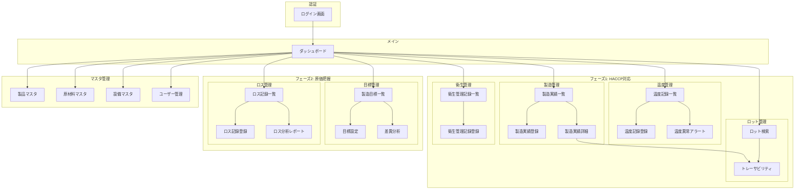

# 川上食品 HACCP管理システム 画面遷移図

## 全体構成



## 画面一覧

| No | 画面ID | 画面名 | フェーズ | 概要 |
|----|--------|--------|----------|------|
| 1 | LOGIN | ログイン画面 | - | ユーザー認証 |
| 2 | DASH | ダッシュボード | - | システム全体の状況表示 |
| 3 | PROD_LIST | 製造実績一覧 | P1 | 製造実績の一覧表示・検索 |
| 4 | PROD_NEW | 製造実績登録 | P1 | 製造実績の新規登録 |
| 5 | PROD_DETAIL | 製造実績詳細 | P1 | 製造実績の詳細表示・編集 |
| 6 | TEMP_LIST | 温度記録一覧 | P1 | 温度記録の一覧表示 |
| 7 | TEMP_NEW | 温度記録登録 | P1 | 温度記録の新規登録 |
| 8 | TEMP_ALERT | 温度異常アラート | P1 | 温度異常の通知・対応記録 |
| 9 | LOT_SEARCH | ロット検索 | P1 | ロット番号による検索 |
| 10 | LOT_TRACE | トレーサビリティ | P1 | ロット追跡表示 |
| 11 | HYGIENE_LIST | 衛生管理記録一覧 | P1 | 衛生管理記録の一覧 |
| 12 | HYGIENE_NEW | 衛生管理記録登録 | P1 | 衛生管理記録の登録 |
| 13 | TARGET_LIST | 製造目標一覧 | P2 | 製造目標の一覧表示 |
| 14 | TARGET_SET | 目標設定 | P2 | 製造目標の設定 |
| 15 | TARGET_ANALYSIS | 差異分析 | P2 | 目標vs実績の分析 |
| 16 | LOSS_LIST | ロス記録一覧 | P2 | ロス記録の一覧表示 |
| 17 | LOSS_NEW | ロス記録登録 | P2 | ロス記録の新規登録 |
| 18 | LOSS_REPORT | ロス分析レポート | P2 | ロス率推移・分析 |
| 19 | MASTER_PRODUCT | 製品マスタ | - | 製品情報の管理 |
| 20 | MASTER_MATERIAL | 原材料マスタ | - | 原材料情報の管理 |
| 21 | MASTER_FACILITY | 設備マスタ | - | 設備情報の管理 |
| 22 | MASTER_USER | ユーザー管理 | - | ユーザーアカウント管理 |

## ナビゲーション構造

```
├── ダッシュボード
├── HACCP管理（P1）
│   ├── 製造実績
│   │   ├── 一覧
│   │   └── 新規登録
│   ├── 温度管理
│   │   ├── 記録一覧
│   │   ├── 新規登録
│   │   └── アラート
│   ├── ロット追跡
│   │   ├── 検索
│   │   └── トレーサビリティ
│   └── 衛生管理
│       ├── 記録一覧
│       └── 新規登録
├── 原価管理（P2）
│   ├── 製造目標
│   │   ├── 目標一覧
│   │   ├── 目標設定
│   │   └── 差異分析
│   └── ロス管理
│       ├── 記録一覧
│       ├── 新規登録
│       └── 分析レポート
├── マスタ管理
│   ├── 製品マスタ
│   ├── 原材料マスタ
│   ├── 設備マスタ
│   └── ユーザー管理
└── ログアウト
```
