# 業務フロー図

## 川上食品 HACCP管理システム

---

| 項目 | 内容 |
|------|------|
| 文書番号 | KF-BF-2026-001 |
| 版数 | 1.0 |
| 作成日 | 2026年2月9日 |
| 作成者 | サムライテクノロジー株式会社 |
| 関連文書 | 要件定義書（KF-RD-2026-001） |

---

## 改訂履歴

| 版数 | 日付 | 変更内容 | 作成者 |
|------|------|----------|--------|
| 1.0 | 2026/02/09 | 初版作成 | サムライテクノロジー |

---

## 目次

1. [業務フロー一覧](#1-業務フロー一覧)
2. [全体業務フロー](#2-全体業務フロー)
3. [認証業務フロー](#3-認証業務フロー)
4. [ダッシュボード業務フロー](#4-ダッシュボード業務フロー)
5. [温度管理業務フロー](#5-温度管理業務フロー)
6. [製造管理業務フロー](#6-製造管理業務フロー)
7. [ロット管理業務フロー](#7-ロット管理業務フロー)
8. [衛生管理業務フロー](#8-衛生管理業務フロー)
9. [製造目標管理業務フロー](#9-製造目標管理業務フロー)
10. [ロス管理業務フロー](#10-ロス管理業務フロー)
11. [マスタ管理業務フロー](#11-マスタ管理業務フロー)

---

## 1. 業務フロー一覧

### 1.1 業務フローとユースケースの対応表

| No. | 業務フローID | 業務フロー名 | 対応ユースケース | フェーズ |
|-----|-------------|-------------|-----------------|:--------:|
| 1 | BF-AUTH-01 | ログイン・ログアウト | UC-AUTH-01, UC-AUTH-02 | 共通 |
| 2 | BF-DASH-01 | ダッシュボード閲覧 | UC-DASH-01 | 共通 |
| 3 | BF-TEMP-01 | 温度記録・異常検知 | UC-TEMP-01, UC-TEMP-02 | P1 |
| 4 | BF-TEMP-02 | 温度異常アラート対応 | UC-TEMP-03, UC-TEMP-04 | P1 |
| 5 | BF-PROD-01 | 製造実績登録 | UC-PROD-01, UC-PROD-02, UC-PROD-03 | P1 |
| 6 | BF-PROD-02 | 製造実績編集 | UC-PROD-04 | P1 |
| 7 | BF-LOT-01 | 原材料ロット登録 | UC-LOT-01 | P1 |
| 8 | BF-LOT-02 | ロットトレーサビリティ | UC-LOT-01, UC-LOT-02, UC-LOT-03, UC-LOT-04 | P1 |
| 9 | BF-HYG-01 | 衛生記録登録・閲覧 | UC-HYG-01, UC-HYG-02 | P1 |
| 10 | BF-TGT-01 | 製造目標設定・分析 | UC-TGT-01, UC-TGT-02, UC-TGT-03 | P2 |
| 11 | BF-LOSS-01 | ロス記録登録 | UC-LOSS-01, UC-LOSS-02 | P2 |
| 12 | BF-LOSS-02 | ロス分析レポート | UC-LOSS-03 | P2 |
| 13 | BF-MST-01 | マスタデータ管理 | UC-MST-01, UC-MST-02, UC-MST-03, UC-MST-04 | 共通 |

### 1.2 アクター別業務フロー対応表

| 業務フロー | ADMIN | MANAGER | WORKER |
|-----------|:-----:|:-------:|:------:|
| BF-AUTH-01 ログイン・ログアウト | ○ | ○ | ○ |
| BF-DASH-01 ダッシュボード閲覧 | ○ | ○ | ○ |
| BF-TEMP-01 温度記録・異常検知 | ○ | ○ | ○ |
| BF-TEMP-02 温度異常アラート対応 | ○ | ○ | × |
| BF-PROD-01 製造実績登録 | ○ | ○ | ○ |
| BF-PROD-02 製造実績編集 | ○ | ○ | × |
| BF-LOT-01 原材料ロット登録 | ○ | ○ | ○ |
| BF-LOT-02 ロットトレーサビリティ | ○ | ○ | ○ |
| BF-HYG-01 衛生記録登録・閲覧 | ○ | ○ | ○ |
| BF-TGT-01 製造目標設定・分析 | ○ | ○ | × |
| BF-LOSS-01 ロス記録登録 | ○ | ○ | ○ |
| BF-LOSS-02 ロス分析レポート | ○ | ○ | × |
| BF-MST-01 マスタデータ管理 | ○ | × | × |

---

## 2. 全体業務フロー

### 2.1 日常業務の全体像

本システムにおける川上食品の1日の業務フローを示す。

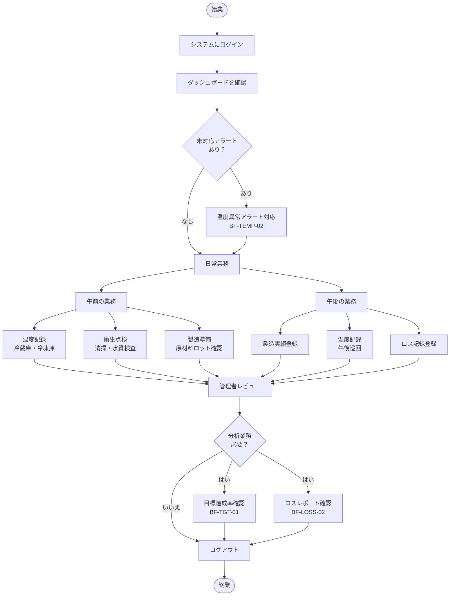

### 2.2 業務領域間の関連

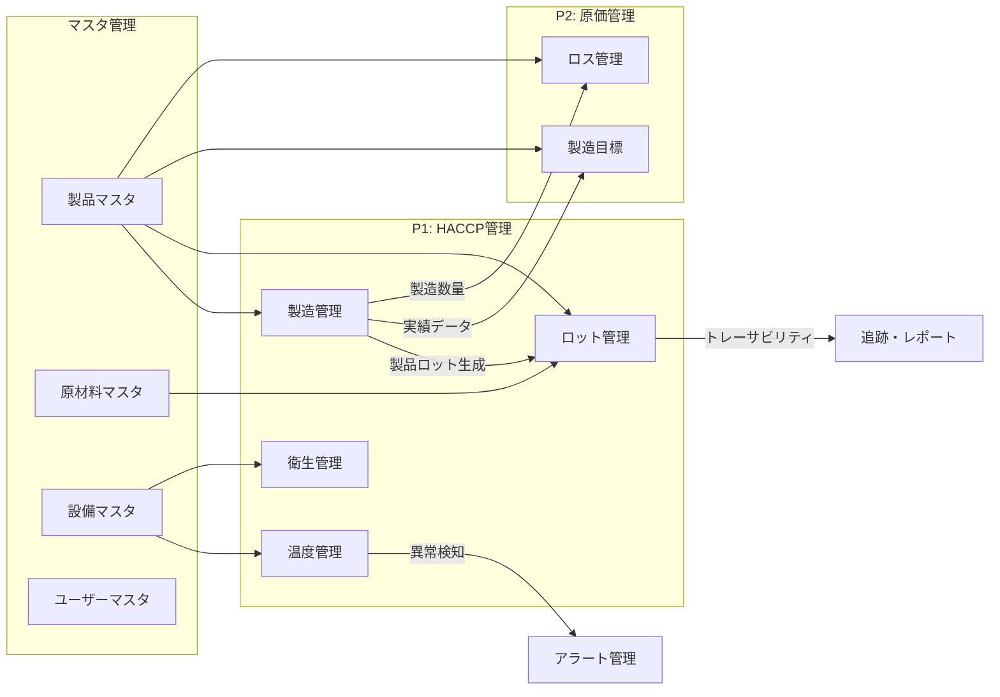

---

## 3. 認証業務フロー

### BF-AUTH-01: ログイン・ログアウト

**対応ユースケース**: UC-AUTH-01（ログイン）、UC-AUTH-02（ログアウト）

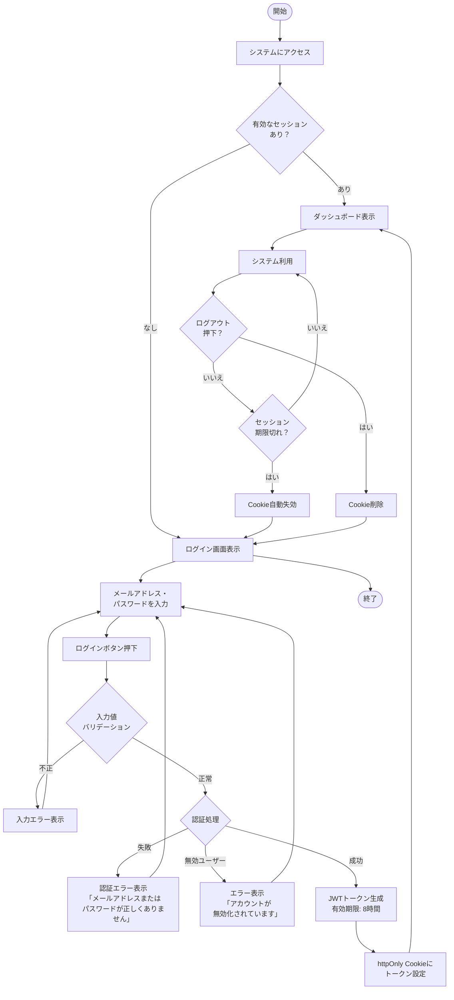

**処理詳細**:

| ステップ | 処理内容 | 関連テーブル |
|---------|---------|-------------|
| 認証処理 | メールアドレスでユーザー検索、bcryptでパスワード照合 | users |
| JWT生成 | HS256署名、ペイロード: userId, email, role, name | - |
| Cookie設定 | httpOnly, Secure, SameSite=Lax, Path=/, MaxAge=28800秒 | - |
| ログアウト | Cookie削除（MaxAge=0） | - |

---

## 4. ダッシュボード業務フロー

### BF-DASH-01: ダッシュボード閲覧

**対応ユースケース**: UC-DASH-01（ダッシュボード閲覧）

```mermaid
flowchart TD
    START([ダッシュボード\n表示開始]) --> PARALLEL[データ並列取得\nSWR + 30秒ポーリング]

    PARALLEL --> KPI[KPIデータ取得]
    PARALLEL --> ALERTS[アラートデータ取得]
    PARALLEL --> CHART[製造推移データ取得]
    PARALLEL --> TEMP_STATUS[温度状況データ取得]
    PARALLEL --> ACTIVITIES[最近の活動データ取得]

    KPI --> KPI_CALC[KPI算出]
    KPI_CALC --> KPI_DISPLAY[KPIカード表示]

    subgraph KPI算出詳細
        KPI_1[本日の製造数量\n= 当日の製造実績合計]
        KPI_2[目標達成率\n= 当月実績/当月目標 × 100]
        KPI_3[ロス率\n= 当月ロス/当月製造 × 100]
        KPI_4[温度異常件数\n= OPEN状態のアラート数]
    end

    KPI_CALC --> KPI_1
    KPI_CALC --> KPI_2
    KPI_CALC --> KPI_3
    KPI_CALC --> KPI_4

    ALERTS --> HAS_ALERT{未対応アラート\nあり？}
    HAS_ALERT -->|あり| SHOW_BANNER[警告バナー表示\n赤背景・アラート件数]
    HAS_ALERT -->|なし| NO_BANNER[バナー非表示]

    SHOW_BANNER --> CLICK_BANNER{バナー\nクリック？}
    CLICK_BANNER -->|はい| GO_ALERT[アラート管理画面\nへ遷移]
    CLICK_BANNER -->|いいえ| CONTINUE

    CHART --> SHOW_CHART[製造推移グラフ表示\n過去7日間の棒グラフ]
    TEMP_STATUS --> SHOW_TEMP[温度一覧テーブル表示\n各設備の最新温度]
    ACTIVITIES --> SHOW_ACT[最近の活動表示]

    NO_BANNER --> CONTINUE[ダッシュボード表示完了]
    SHOW_CHART --> CONTINUE
    SHOW_TEMP --> CONTINUE
    SHOW_ACT --> CONTINUE

    CONTINUE --> POLLING[30秒後に\n自動データ更新]
    POLLING --> PARALLEL

    CONTINUE --> QUICK_ACTION{クイック\nアクション？}
    QUICK_ACTION -->|製造実績登録| GO_PROD[/production/new]
    QUICK_ACTION -->|温度記録| GO_TEMP[/temperature/new]
    QUICK_ACTION -->|ロット検索| GO_LOT[/lots]
```

---

## 5. 温度管理業務フロー

### BF-TEMP-01: 温度記録・異常検知

**対応ユースケース**: UC-TEMP-01（温度記録一覧閲覧）、UC-TEMP-02（温度記録）

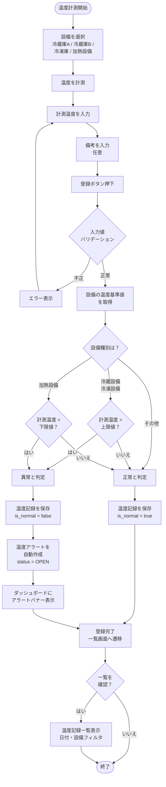

**温度異常検知ルール**:

| 設備種別 | 基準値 | 異常判定条件 | 例 |
|---------|--------|------------|-----|
| 冷蔵設備 (REFRIGERATOR) | 上限 5.0℃ | 計測温度 > 上限値 | 8.5℃ → 異常 |
| 冷凍設備 (FREEZER) | 上限 -15.0℃ | 計測温度 > 上限値 | -10.0℃ → 異常 |
| 加熱設備 (HEATER) | 下限 75.0℃ | 計測温度 < 下限値 | 60.0℃ → 異常 |
| その他 (OTHER) | なし | 常に正常 | - |

---

### BF-TEMP-02: 温度異常アラート対応

**対応ユースケース**: UC-TEMP-03（アラート一覧閲覧）、UC-TEMP-04（温度異常対応）

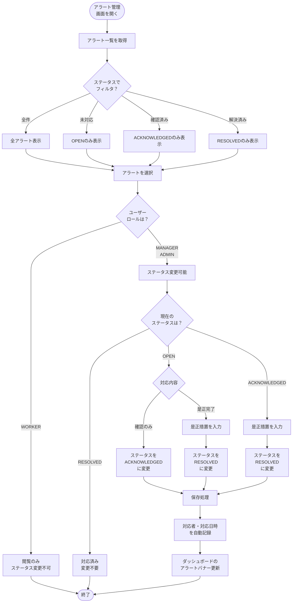

**アラートステータス遷移**:

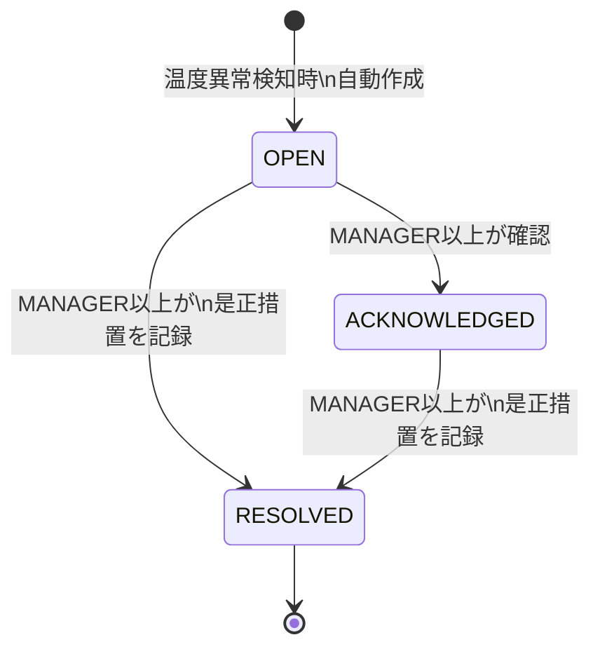

---

## 6. 製造管理業務フロー

### BF-PROD-01: 製造実績登録

**対応ユースケース**: UC-PROD-01（一覧閲覧）、UC-PROD-02（登録）、UC-PROD-03（詳細閲覧）

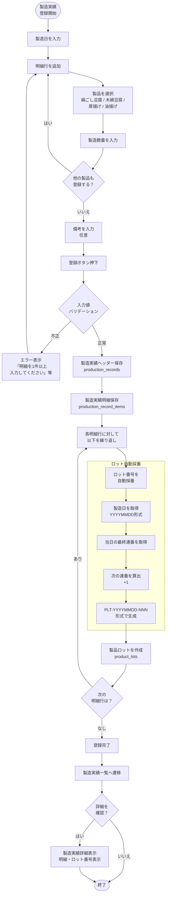

**ロット番号採番ルール**:

| 項目 | 内容 |
|------|------|
| 形式 | `PLT-YYYYMMDD-NNN` |
| 例 | `PLT-20260209-001`、`PLT-20260209-002` |
| 連番リセット | 日付が変わると001から再開 |
| 重複制御 | 同日の最終連番+1で新規採番 |

---

### BF-PROD-02: 製造実績編集

**対応ユースケース**: UC-PROD-04（製造実績編集）

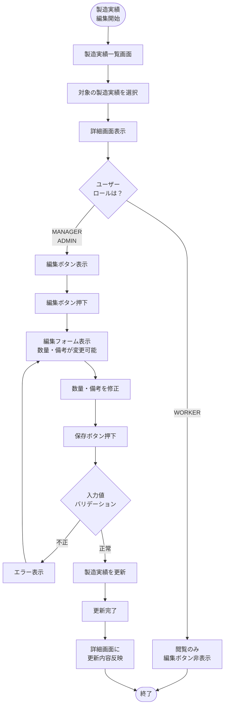

---

## 7. ロット管理業務フロー

### BF-LOT-01: 原材料ロット登録

**対応ユースケース**: UC-LOT-01（ロット検索）

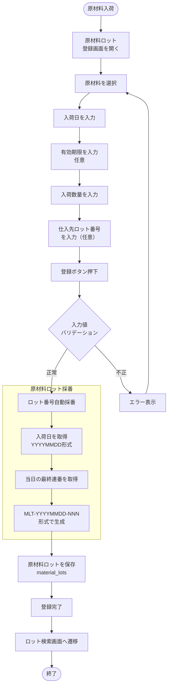

---

### BF-LOT-02: ロットトレーサビリティ

**対応ユースケース**: UC-LOT-01（検索）、UC-LOT-02（前方追跡）、UC-LOT-03（後方追跡）、UC-LOT-04（レポート出力）

```mermaid
flowchart TD
    START([トレーサビリティ\n業務開始]) --> SEARCH_PAGE[ロット検索画面を開く]

    SEARCH_PAGE --> SELECT_TAB{検索対象は？}
    SELECT_TAB -->|製品ロット| PRODUCT_TAB[製品ロットタブ選択]
    SELECT_TAB -->|原材料ロット| MATERIAL_TAB[原材料ロットタブ選択]

    PRODUCT_TAB --> INPUT_KEYWORD_P[キーワード入力\nロット番号/製品名]
    INPUT_KEYWORD_P --> SEARCH_P[検索実行]
    SEARCH_P --> RESULT_P[製品ロット一覧表示\nロット番号・製品名・\n製造日・数量]

    MATERIAL_TAB --> INPUT_KEYWORD_M[キーワード入力\nロット番号/原材料名]
    INPUT_KEYWORD_M --> SEARCH_M[検索実行]
    SEARCH_M --> RESULT_M[原材料ロット一覧表示\nロット番号・原材料名・\n入荷日・数量]

    RESULT_P --> SELECT_LOT_P[製品ロットを選択]
    RESULT_M --> SELECT_LOT_M[原材料ロットを選択]

    SELECT_LOT_P --> TRACE_DETAIL_P[トレース詳細画面]
    SELECT_LOT_M --> TRACE_DETAIL_M[トレース詳細画面]

    TRACE_DETAIL_P --> BACKWARD[後方追跡\nBackward Trace]
    TRACE_DETAIL_M --> FORWARD[前方追跡\nForward Trace]

    subgraph 後方追跡（製品→原材料）
        BACKWARD --> FIND_LINKS_B[LotLinkテーブルから\n紐付けを検索]
        FIND_LINKS_B --> GET_MAT_LOTS[使用された\n原材料ロット一覧取得]
        GET_MAT_LOTS --> SHOW_TREE_B[ツリー表示\n製品ロット\n├ 原材料ロット1\n└ 原材料ロット2]
    end

    subgraph 前方追跡（原材料→製品）
        FORWARD --> FIND_LINKS_F[LotLinkテーブルから\n紐付けを検索]
        FIND_LINKS_F --> GET_PROD_LOTS[製造された\n製品ロット一覧取得]
        GET_PROD_LOTS --> SHOW_TREE_F[ツリー表示\n原材料ロット\n├ 製品ロット1\n└ 製品ロット2]
    end

    SHOW_TREE_B --> END_FLOW([終了])
    SHOW_TREE_F --> END_FLOW
```

**トレーサビリティ利用場面**:

| 場面 | 追跡方向 | 目的 |
|------|---------|------|
| 食品事故・リコール発生時 | 前方追跡（原材料→製品） | 問題のある原材料が使用された製品の特定・回収範囲確定 |
| クレーム受領時 | 後方追跡（製品→原材料） | 問題製品に使用された原材料の特定・原因調査 |
| 定期監査 | 双方向 | HACCPに基づくトレーサビリティ体制の証明 |

---

## 8. 衛生管理業務フロー

### BF-HYG-01: 衛生記録登録・閲覧

**対応ユースケース**: UC-HYG-01（一覧閲覧）、UC-HYG-02（記録登録）

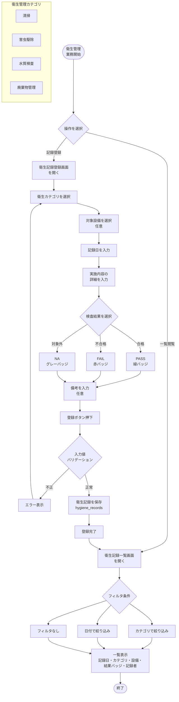

---

## 9. 製造目標管理業務フロー

### BF-TGT-01: 製造目標設定・分析

**対応ユースケース**: UC-TGT-01（一覧閲覧）、UC-TGT-02（目標設定）、UC-TGT-03（達成分析）

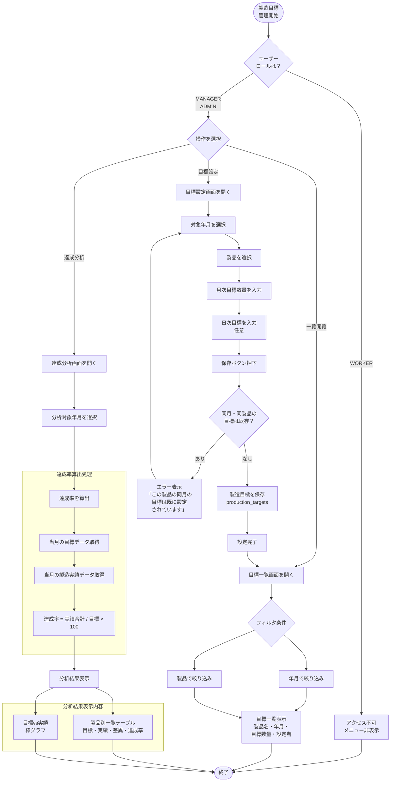

**達成率計算ロジック**:

```
達成率（%） = (当月の製造実績合計 / 当月の目標数量) × 100

例:
  目標: 絹ごし豆腐 10,000個/月
  実績: 9,420個
  達成率: (9,420 / 10,000) × 100 = 94.2%
```

---

## 10. ロス管理業務フロー

### BF-LOSS-01: ロス記録登録

**対応ユースケース**: UC-LOSS-01（一覧閲覧）、UC-LOSS-02（記録登録）

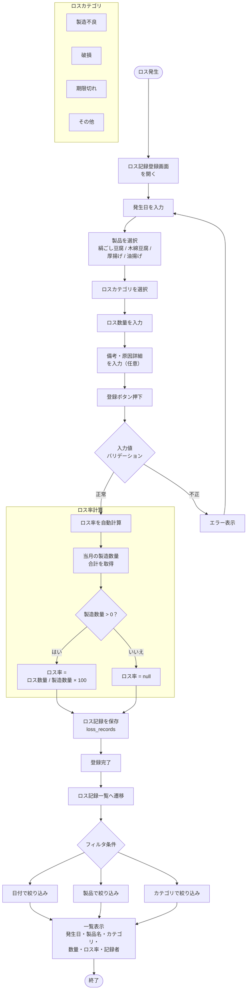

---

### BF-LOSS-02: ロス分析レポート

**対応ユースケース**: UC-LOSS-03（ロス分析レポート閲覧）

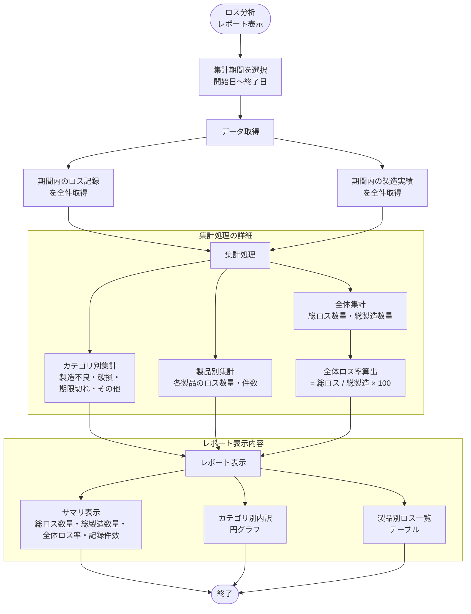

**ロス率計算例**:

| 製品 | 月間製造数量 | 月間ロス数量 | ロス率 |
|------|:----------:|:----------:|:-----:|
| 絹ごし豆腐 | 5,000個 | 90個 | 1.8% |
| 木綿豆腐 | 4,000個 | 84個 | 2.1% |
| 厚揚げ | 2,000個 | 70個 | 3.5% |
| 油揚げ | 1,500個 | 63個 | 4.2% |
| **全体** | **12,500個** | **307個** | **2.5%** |

---

## 11. マスタ管理業務フロー

### BF-MST-01: マスタデータ管理

**対応ユースケース**: UC-MST-01（製品）、UC-MST-02（原材料）、UC-MST-03（設備）、UC-MST-04（ユーザー）

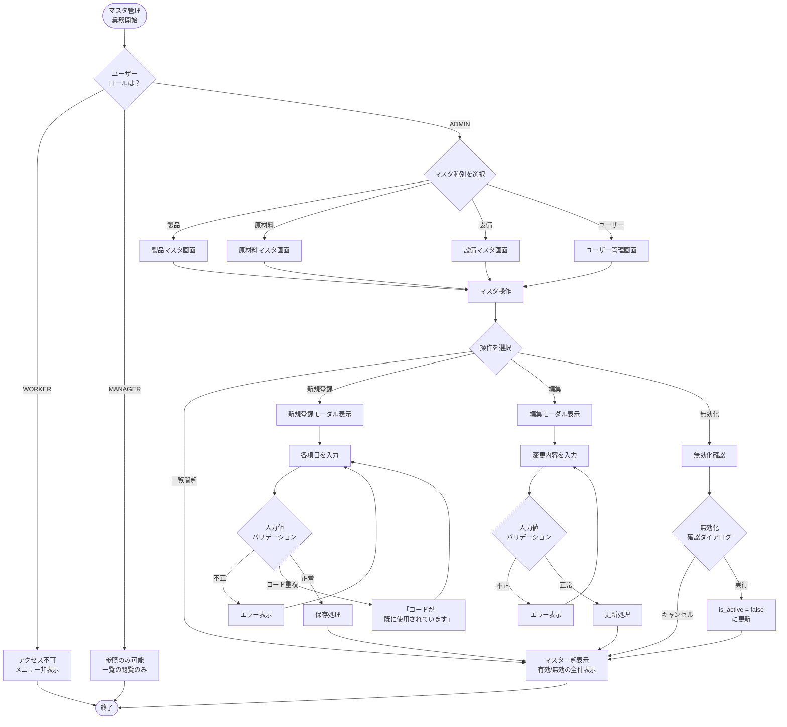

**マスタ別入力項目**:

| マスタ | 必須入力項目 | 任意入力項目 | 特記事項 |
|--------|------------|------------|---------|
| 製品 | コード、名称、単位 | - | コードは一意制約 |
| 原材料 | コード、名称、単位 | 仕入先 | コードは一意制約 |
| 設備 | コード、名称、種別 | 設置場所、温度上限、温度下限 | 温度基準値は異常検知に使用 |
| ユーザー | 氏名、メール、パスワード、ロール | - | パスワードはbcryptハッシュ化。ADMIN限定操作 |

---

## 承認

本業務フロー図の内容について、下記の通り承認します。

### 発注者（甲）

| 項目 | 内容 |
|------|------|
| 会社名 | 川上食品株式会社 |
| 役職・氏名 | 代表取締役　　　　　　　　　　　　　　|
| 日付 | 　　　　年　　　月　　　日 |
| 署名 | |

### 受注者（乙）

| 項目 | 内容 |
|------|------|
| 会社名 | サムライテクノロジー株式会社 |
| 役職・氏名 | 　　　　　　　　　　　　　　　　　　|
| 日付 | 　　　　年　　　月　　　日 |
| 署名 | |

---

以上
